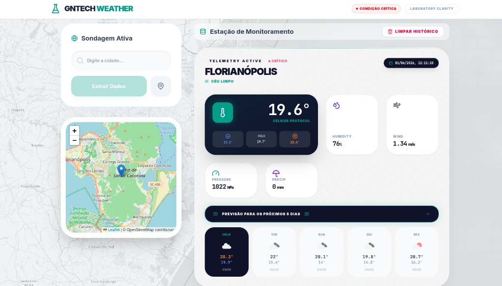

# GnTechWeather

> Estação de monitoramento ambiental de precisão — desenvolvida como teste técnico para o laboratório de genética **GnTech**.

A aplicação coleta dados climáticos em tempo real via OpenWeather API, persiste no PostgreSQL e os exibe em uma interface construída com React + Tailwind CSS. O design segue o conceito **Laboratory Clarity / Atmospheric Signal**: dados têm textura antes de ter forma.



---

## Funcionalidades

| Funcionalidade | Descrição |
|---|---|
| Busca com autocomplete | Sugestões em tempo real com prioridade para cidades brasileiras |
| Extração por cidade ou GPS | Coleta dados meteorológicos completos e persiste no banco |
| Previsão 5 dias | Botão expansível em cada card — ícone, temp min/max e dia da semana para os próximos 5 dias |
| Gráfico de histórico | Série temporal de temperatura e umidade por cidade (clique no card) |
| Índice laboratorial | Badge por leitura + status global indicando condição ideal/aceitável/crítica |
| Mapa de fundo interativo | Mapa-múndi monocromático que anima até a cidade selecionada |
| Mapa local com nuvens | Visualização de rua com camada de nuvens OpenWeather em tempo real |
| Histórico de monitoramento | Todos os registros coletados, ordenados do mais recente |

---

## Início Rápido

**Pré-requisitos:** Docker e Docker Compose instalados.

```bash
# 1. Clone o repositório
git clone https://github.com/pedropompeu/GnTechWeather.git
cd TestGnTech

# 2. Configure as variáveis de ambiente
cp .env.example .env
# Edite .env e insira sua OPENWEATHER_API_KEY

# 3. Suba todos os serviços
docker compose up --build
```

| Serviço | URL |
|---|---|
| Frontend | http://localhost:3000 |
| API (Swagger UI) | http://localhost:8000/docs |
| PostgreSQL | localhost:5435 |

> A API Key gratuita da OpenWeather está disponível em [openweathermap.org](https://openweathermap.org/api).

---

## Arquitetura

```
┌─────────────────────────────────────────────────────────┐
│                     Docker Compose                       │
│                                                         │
│  ┌──────────────┐    ┌──────────────┐    ┌──────────┐  │
│  │   client     │    │     api      │    │    db    │  │
│  │  React/Vite  │───▶│   FastAPI    │───▶│ Postgres │  │
│  │  nginx:80    │    │  uvicorn:8000│    │  :5432   │  │
│  └──────────────┘    └──────────────┘    └──────────┘  │
│         │                   │                           │
│         │            OpenWeather API                    │
│         │           (externo, HTTPS)                    │
└─────────────────────────────────────────────────────────┘
```

### Backend — Camadas

```
app/
├── api/v1/endpoints/   # Routers (controllers) — FastAPI
├── services/           # Lógica de negócio
├── repositories/       # Acesso ao banco (Repository Pattern)
├── models/             # Modelos SQLAlchemy (ORM)
├── schemas/            # Validação de entrada/saída (Pydantic v2)
├── core/               # Configurações, rate limiter
└── db/                 # Engine assíncrona, session factory
```

### Decisões de Arquitetura

**Repository Pattern** — o `WeatherRepository` herda de `BaseRepository[T]`, que implementa `get`, `get_multi`, `create` e `delete_all` de forma genérica. Facilita extensão para novos modelos sem duplicação.

**Async de ponta a ponta** — FastAPI + SQLAlchemy async (`asyncpg`) + `httpx.AsyncClient` para chamadas à OpenWeather API. Nenhuma operação bloqueante no event loop.

**Session com commit/rollback automático** — a dependency `get_db()` faz `commit` ao sucesso e `rollback` em exceção, garantindo consistência sem que os endpoints precisem gerenciar transações manualmente.

**Rate Limiting** — `slowapi` limita endpoints de extração a 10 requisições/minuto por IP, protegendo a cota da API externa.

---

## Stack Completa

| Camada | Tecnologia | Versão |
|---|---|---|
| Backend | FastAPI | 0.104 |
| Runtime | Python | 3.11 |
| ORM | SQLAlchemy (async) | 2.0 |
| Driver DB | asyncpg | 0.29 |
| HTTP Client | httpx | 0.25 |
| Validação | Pydantic v2 | 2.5 |
| Rate Limiting | slowapi | 0.1.9 |
| Banco de Dados | PostgreSQL | 15 |
| Frontend | React + TypeScript | 18 / 5.2 |
| Build Tool | Vite | 5.0 |
| Estilização | Tailwind CSS | 3.3 |
| Mapas | React-Leaflet | 4.2 |
| Gráficos | Recharts | 2.10 |
| Orquestração | Docker Compose | — |

---

## API Reference

Base URL: `http://localhost:8000/api/v1`

| Método | Endpoint | Descrição |
|---|---|---|
| `GET` | `/weather/search?q={query}` | Autocomplete de cidades |
| `POST` | `/weather/extract?city={nome}` | Extrai dados por nome de cidade |
| `POST` | `/weather/extract/geo?lat={}&lon={}` | Extrai dados por coordenadas GPS |
| `GET` | `/weather/forecast?city={nome}` | Previsão dos próximos 5 dias |
| `GET` | `/weather/history?limit={n}` | Retorna histórico de extrações |
| `DELETE` | `/weather/history` | Limpa todo o histórico |

Documentação interativa completa (Swagger UI) disponível em `/docs`.

<details>
<summary>Exemplo de resposta — POST /weather/extract</summary>

```json
{
  "id": 1,
  "city": "Florianópolis",
  "lat": -27.6146,
  "lon": -48.5012,
  "temperature": 19.0,
  "feels_like": 19.0,
  "temp_min": 18.1,
  "temp_max": 19.6,
  "pressure": 1022,
  "humidity": 79,
  "wind_speed": 1.54,
  "wind_deg": 0,
  "rain_1h": 0.0,
  "description": "algumas nuvens",
  "icon": "02d",
  "extracted_at": "2026-06-01T13:17:35.960490Z"
}
```
</details>

<details>
<summary>Exemplo de resposta — GET /weather/forecast</summary>

```json
[
  { "date": "01/06", "weekday": "Seg", "temp_min": 15.6, "temp_max": 22.0, "humidity": 74, "description": "nublado", "icon": "04d" },
  { "date": "02/06", "weekday": "Ter", "temp_min": 14.0, "temp_max": 20.1, "humidity": 77, "description": "nublado", "icon": "04d" },
  { "date": "03/06", "weekday": "Qua", "temp_min": 14.8, "temp_max": 19.8, "humidity": 84, "description": "nublado", "icon": "04d" },
  { "date": "04/06", "weekday": "Qui", "temp_min": 16.2, "temp_max": 21.5, "humidity": 70, "description": "céu limpo", "icon": "01d" },
  { "date": "05/06", "weekday": "Sex", "temp_min": 17.0, "temp_max": 23.0, "humidity": 65, "description": "poucas nuvens", "icon": "02d" }
]
```
</details>

---

## Índice de Condição Laboratorial

Cada leitura é classificada automaticamente com base em temperatura e umidade:

| Condição | Temperatura | Umidade | Cor |
|---|---|---|---|
| **Ideal** | 18°C – 24°C | 40% – 60% | Verde |
| **Aceitável** | 15°C – 27°C | 35% – 65% | Âmbar |
| **Crítico** | Fora dos ranges | Fora dos ranges | Vermelho |

O badge aparece em cada card de leitura e o status da última extração é exibido no header da aplicação.

---

## Estrutura de Arquivos

```
TestGnTech/
├── backend/
│   ├── app/
│   │   ├── api/v1/endpoints/weather.py   # Rotas da API
│   │   ├── core/
│   │   │   ├── config.py                 # Settings via Pydantic
│   │   │   └── limiter.py                # Rate limiter (slowapi)
│   │   ├── db/session.py                 # Engine async + get_db()
│   │   ├── models/weather.py             # Modelo SQLAlchemy
│   │   ├── repositories/                 # BaseRepository + WeatherRepository
│   │   ├── schemas/weather.py            # Pydantic schemas + ForecastDay
│   │   ├── services/weather_service.py   # Lógica + integração OpenWeather
│   │   └── main.py                       # App FastAPI, CORS, startup
│   ├── Dockerfile
│   └── requirements.txt
├── client/
│   ├── src/
│   │   ├── components/
│   │   │   ├── BackgroundMap.tsx         # Mapa de fundo interativo (fixed)
│   │   │   ├── HistoryChart.tsx          # Gráfico de série temporal (recharts)
│   │   │   ├── WeatherCard.tsx           # Card com dados, índice laboratorial e previsão 5 dias expansível
│   │   │   └── WeatherMap.tsx            # Mapa local com camada de nuvens
│   │   ├── api/client.ts                 # Axios configurado
│   │   └── App.tsx                       # Estado global e layout
│   ├── tailwind.config.js
│   ├── Dockerfile
│   └── package.json
├── db/
│   └── init.sql                          # Schema inicial do PostgreSQL
├── docker-compose.yml
├── .env.example
└── .gitignore
```

---

## Variáveis de Ambiente

```bash
# .env
DB_USER=gntech
DB_PASSWORD=gntech_pass
DB_NAME=weather_db
OPENWEATHER_API_KEY=sua_chave_aqui   # https://openweathermap.org/api
```

O arquivo `.env` está no `.gitignore` e nunca é versionado. Use `.env.example` como base.
